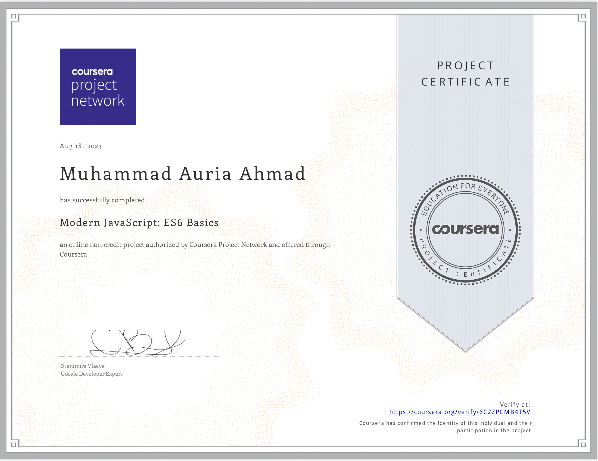

# Web Development Journey 🌐
[Verify](https://coursera.org/share/b5a6aaf509f3bd4e117990c5d0915711)

## HTML, CSS, and JavaScript Course for Web Developers John Hopkins University on Coursera
## Also a Short Course of ES6🚀
[Verify](https://coursera.org/share/ddbfc6db6888bddef1132e4bb20cd719)

Equipped with a solid foundation in web development basics! 🛠️

**Key Takeaways:**
From HTML5 basics and CSS3 concepts to responsive design and client interaction, the course covered:

- Building valid HTML5 structures with semantic tags.
- Mastering CSS3 techniques like the 'box model' and responsive design.
- Practical client interaction and real web project development.
- Empowering JavaScript language skills and concepts.
- Modern ES6 syntax
- Manipulating web page components with the Document Object Model.
- Utilizing Ajax for dynamic data interaction and JSON processing.

This course experience has emphasized the significance of establishing a strong foundation in mastering the fundamentals.

## Onward Journey
Excited to keep building and growing with React! Looking forward to the next learning steps.

## Let's Connect! 👋
Keen to chat about React or the journey ahead? Connect on LinkedIn!

[Connect on LinkedIn](https://www.linkedin.com/in/muhammad-auria-ahmad)
